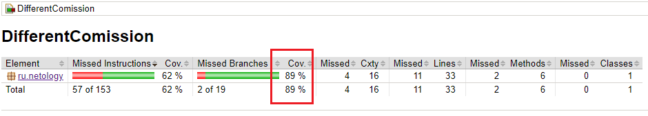

# Описание проекта

Алгоритм расчёта в виде функции, передавая в функцию:

- тип карты/счёта (по умолчанию VK Pay);
- сумму предыдущих переводов в этом месяце (по умолчанию 0 рублей);
- сумму совершаемого перевода.

Покрытие 89%:

